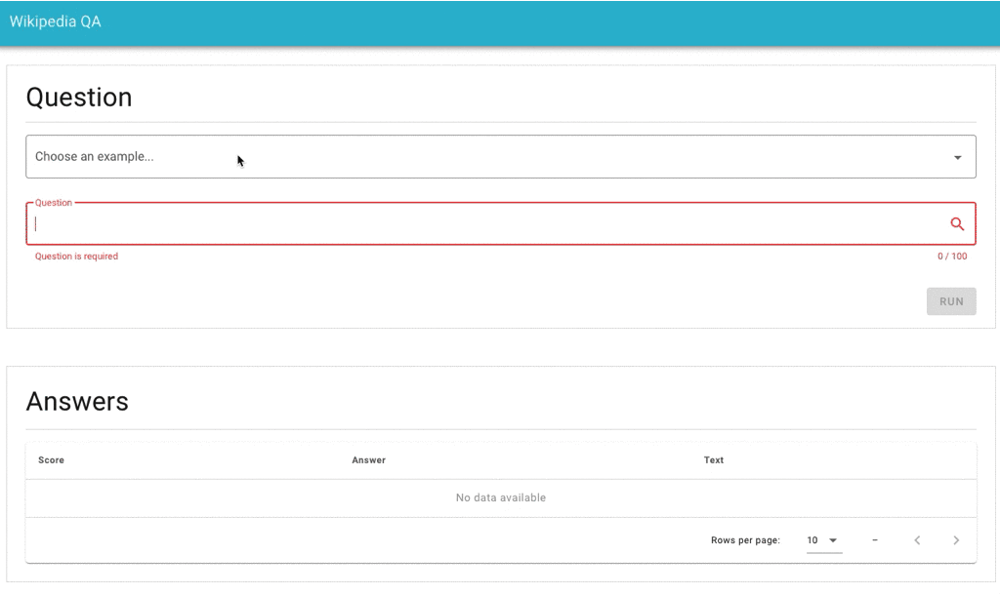

# Wikipedia QA

Wikipedia QA is a question answering system based on Wikipedia. Below is an example of question and answer:



<!--
## System architecture


-->

## Getting Started

### 1. Clone the repository

```bash
$ git clone https://github.com/Hironsan/WikipediaQA.git
$ cd WikipediaQA/src
```

### 2. Install dependencies

```bash
$ pip install -r requirements.txt
```

### 3. Run the application

```bash
$ flask run
```

### 4. Open browser

Go to <http://127.0.0.1:5000>.
